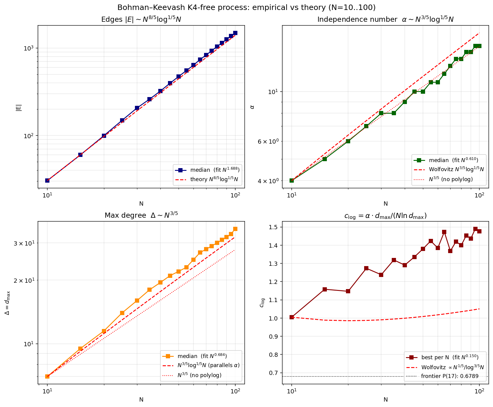
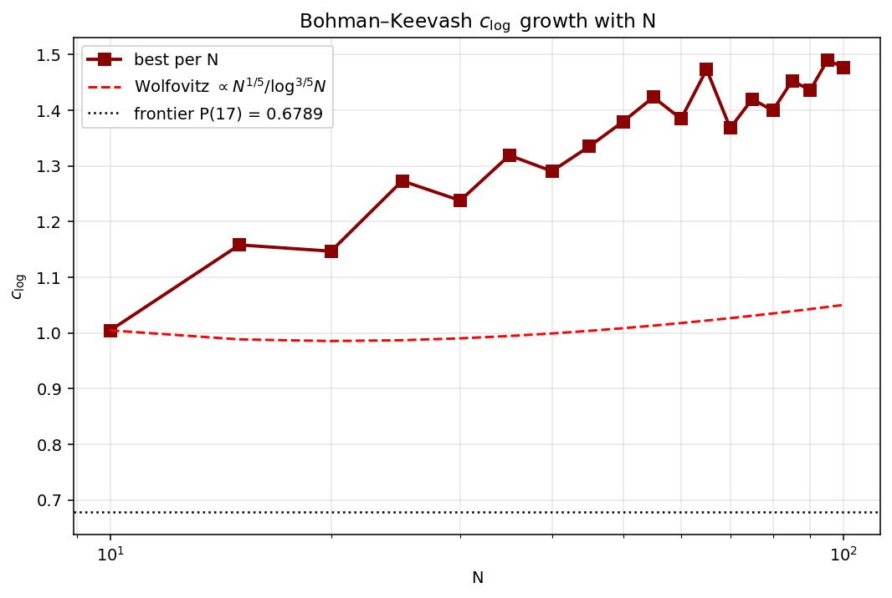

# The K₄-free random process (a.k.a. "Bohman–Keevash")

The K₄-free process is the random greedy generator of K₄-free graphs:
start from the empty graph on $N$ vertices, traverse the $\binom{N}{2}$
edges in uniformly random order, and add each edge unless adding it
would create a $K_4$. Stop when the order is exhausted (equivalently:
when no $K_4$-safe non-edge remains, i.e. the graph is $K_4$-saturated).
Denote the resulting graph by $M(N)$.

Across the literature the process is variously called the "random
$K_4$-free process," the "$K_4$-free random graph process," or the
$H$-free process specialised to $H = K_4$. Bohman & Keevash (2010+)
extended the analysis to the general $H$-free process; for $K_4$ in
particular the asymptotically tight bounds are due to Bohman (lower)
and Wolfovitz (upper). The repository's source-tag `bohman_keevash`
is shorthand for this family of results.

> Implemented at [`experiments/random/bohman_keevash.py`](../../experiments/random/bohman_keevash.py).
> Sweep + plots: [`experiments/random/sweep_bohman_keevash.py`](../../experiments/random/sweep_bohman_keevash.py).
> Best-per-$N$ outputs ($N=10\ldots 100$, step 5) live at
> [`graphs/bohman_keevash.json`](../../graphs/bohman_keevash.json),
> per-$N$ statistics at
> [`experiments/random/results/bohman_keevash_sweep.csv`](../../experiments/random/results/bohman_keevash_sweep.csv).

---

## Why this process is the canonical pseudorandom $K_4$-free baseline

Three reasons it shows up everywhere extremal $K_4$-free results are
discussed:

1. **It is genuinely random under a $K_4$-free conditioning.** No
   structural choice is made — every step is uniform over the K₄-safe
   non-edge set. So $M(N)$ is a maximally unbiased pseudorandom
   $K_4$-free graph, and its parameters are the natural null hypothesis
   any "smarter" $K_4$-free construction must beat.

2. **It implies sharp Ramsey-type lower bounds.** Specifically, for
   $f_{3,4}(N) = \min_{G\,K_4\text{-free},\,|G|=N} (\text{max triangle-free }S\subseteq V(G))$,
   the K₄-free process gives the sharpest known upper bound on this
   minimum, which in turn gives lower bounds on the off-diagonal Ramsey
   number $R(4,t)$. Krivelevich (1995) and Bohman (2009) used the
   process this way; Wolfovitz (2010) tightened the constants by a
   $(\ln N)^{3/10}$ factor.

3. **It is conjecturally tight up to constants.** The asymptotic edge
   count $\Theta(N^{8/5}(\ln N)^{1/5})$ matches the best-known lower
   bound on $\mathrm{ex}(N; K_4, \text{any non-trivial constraint})$,
   so the process is — within polylog factors — the densest $K_4$-free
   construction we know how to prove exists.

For our project specifically, the K₄-free process is interesting as
the **strongest unstructured baseline** for the metric
$c_{\log}(G) = \alpha(G)\,d_{\max}(G) / (N \ln d_{\max}(G))$. Beating
it requires structural rather than random construction (see comparison
below).

---

## Theoretical guarantees

a.a.s. as $N \to \infty$ ([Wolfovitz 2010, arXiv:1008.4044](../papers/The%20K4-free%20process.pdf), Theorems 1.1–1.3):

$$
|E(M(N))| = \Theta\!\left(N^{8/5}\,(\ln N)^{1/5}\right),
\qquad
\alpha(M(N)) = O\!\left(N^{3/5}\,(\ln N)^{1/5}\right),
\qquad
\Delta(M(N)) \approx \frac{2|E|}{N} \sim N^{3/5}\,(\ln N)^{1/5}.
$$

The constants in the $\Theta$ and $O$ depend on $\varepsilon_1$, the
small parameter chosen at the start of the proof; see "Derivation"
below.

### Lineage of the bounds

| Result | $\|E(M(N))\|$ | $\alpha(M(N))$ |
|---|---|---|
| Bollobás–Riordan 2000 [5] | $\Omega(N^{8/5}) \le \cdot \le O(N^{8/5}\ln N)$ | — |
| Krivelevich 1995 [13,14] | — | $\Omega((N\ln\ln N)^{1/2})$ to $O(N^{3/5}(\ln N)^{1/2})$ |
| Osthus–Taraz 2001 [15] | upper $O(N^{8/5}(\ln N)^{1/2})$ | — |
| Bohman 2009 [2] | lower $\Omega(N^{8/5}(\ln N)^{1/5})$ | upper $O(N^{3/5}(\ln N)^{8/5})$ |
| **Wolfovitz 2010 [arXiv:1008.4044]** | upper $O(N^{8/5}(\ln N)^{1/5})$ — closes the gap | **upper $O(N^{3/5}(\ln N)^{1/5})$** |

Wolfovitz's $\alpha$ improvement of $(\ln N)^{3/10}$ over Bohman, and
the matching of Bohman's edge lower bound, jointly establish the
$\Theta$ scalings above as tight up to constants.

---

## Derivation: how the bounds come out

What follows is a high-level pass through the Wolfovitz proof — enough
to motivate where each polylog factor comes from. The full argument
is technical; see arXiv:1008.4044 §3–§8.

### The differential-equation skeleton (where $\Phi$ comes from)

Let $\Phi : \mathbb{R} \to \mathbb{R}$ be the unique function with

$$
\Phi'(x) = \phi(x) := \exp\!\left(-\tfrac{1}{2}\,\Phi(x)^5\right), \qquad \Phi(0) = 0.
$$

This $\Phi$ is the rescaled "edges added so far" curve: parametrising
process time by $t = i\,N^{-\varepsilon_1}$ (where $i$ is the round
index in the iterative process — see below), the count of edges in
$M_i$ concentrates around $\frac{1}{2}\,N^{8/5}\,\Phi(t)$, and the
count of "open" pairs (those still $K_4$-safely addable) concentrates
around $\frac{1}{2}\,N^{2}\,\phi(t)$.

The derivative law $\phi = \exp(-\Phi^5/2)$ comes from a local
calculation: at scaled time $t$, the probability that a fixed pair
$(u,v)$ is *still* $K_4$-safe is $\exp(-\Theta(\Phi(t)^5))$. The
exponent is $5$ because closing $(u,v)$ requires only one of *five*
specific paths (each contributing one independent "way to kill" $(u,v)$):
$\binom{5}{j}$ at $j=0$ is irrelevant, but the natural counting has
five degrees of freedom corresponding to common-neighbour structures
on $u,v$. (See the definition of $X_{i,j}$ in §3 of the paper.)

The standard differential-equation method (Wormald) then says the
random edge count tracks $\frac{1}{2}\,N^{8/5}\,\Phi(t)$ with high
probability. The polylog factor in the final $|E|$ bound comes from
how big $\Phi$ gets at the end of the process, namely

$$
\Phi(I\,N^{-\varepsilon_1}) = \Theta\!\left((\ln N)^{1/5}\right),
\qquad
I = \lfloor N^{\varepsilon_1 + \varepsilon_1^2}\rfloor,
$$

which is Lemma 3.1(i) of the paper. Plugging in:

$$
|E(M_I)| \approx \tfrac{1}{2}\,N^{8/5}\,\Phi(I\,N^{-\varepsilon_1}) = \Theta\!\left(N^{8/5}\,(\ln N)^{1/5}\right).
$$

### The iterative process and why it tracks the actual K₄-free process

The actual K₄-free process is hard to analyse directly because the
event "edge $(u,v)$ is the next one tried" is correlated with the
entire history. Wolfovitz analyses an **iterative process** instead:

- Partition the unit interval of edge birthtimes into $I$ rounds.
  Round $i$ exposes a "bite" $\mathit{Bite}_{i+1}$ — a small random
  subset of not-yet-traversed pairs, each included independently with
  probability $\sim N^{-\varepsilon_1 - \varepsilon_2}$.
- Within $\mathit{Bite}_{i+1}$, traverse in birthtime order and add to
  $M_i$ every edge whose addition stays K₄-free.
- Repeat for $I$ rounds; the result $M_I$ has the same distribution
  (up to negligible error) as the K₄-free process at the corresponding
  "time" $I\,N^{-\varepsilon_1}$.

The iterative formulation is what enables the next step.

### The branching process bound (where the second polylog comes from)

To bound $\alpha(M_I)$, Wolfovitz reduces to: *for every set $S$ of
$s = C\,N^{3/5}(\ln N)^{1/5}$ vertices, $S$ contains a triangle in
$M_I$ with high probability.*

He proves this via a branching-process coupling. Define an infinite
tree $\mathfrak{T}_4$:

- Each node at even distance has $0.5\,N^{5\varepsilon_2}$ children.
- Each node at odd distance has $5$ children.

Assign each node at even distance a uniform $[0,1]$ birthtime. A node
"survives" if (recursively) for every child $\nu_1$, there exists a
child $\nu_2$ of $\nu_1$ with $\beta(\nu_2) > \beta(\nu_0)$ such that
$\nu_1$ has at least one non-surviving child of its own.

The survival probability at the root, $p_{\mathfrak{T}_4}(x)$, solves
the very same differential equation:

$$
p_{\mathfrak{T}_4}(x) = \phi(x), \qquad
P_{\mathfrak{T}_4}(x) := \int_0^x p_{\mathfrak{T}_4}(y)\,dy = \Phi(x).
$$

This is Lemma 4.6 of the paper. The branching process is the local
random structure that controls the global edge count.

The $(\ln N)^{1/5}$ factor in $\alpha$ comes from the same source as
the one in $|E|$: it's $\Phi$ evaluated at the end of the process. The
Ramsey-type argument is then:

- For each set $S$ of $s$ vertices, count the triangles in
  $M_I \cap \binom{S}{2}$ via a McDiarmid concentration argument
  (paper §8.1, Lemma 8.2).
- The expected triangle count in $S$ is
  $\Omega(N^{-\varepsilon_1 - 2/5}\,y_{i,1,s^3})$ per round, with
  $y_{i,1,t} = t\,\binom{3}{1}\Phi(\cdot)^4 \phi(\cdot)$.
- Summing across rounds gives expected triangles $\Omega(s\,\ln N)$.
- McDiarmid + union bound across all $\binom{N}{s}$ choices of $S$
  closes the argument: with $C = C(\varepsilon_1)$ large enough,
  $\Pr[\exists S \text{ triangle-free}] = o(N^{-s})$, which suppresses
  the union bound.

Hence $\alpha(M_I) < s = C\,N^{3/5}(\ln N)^{1/5}$ a.a.s.

### How the implied $c_{\log}$ scaling falls out

With the above:

$$
\alpha\,d_{\max} \sim N^{3/5}(\ln N)^{1/5} \cdot N^{3/5}(\ln N)^{1/5} = N^{6/5}(\ln N)^{2/5},
$$

and $\ln d_{\max} = \ln\!\left(N^{3/5}(\ln N)^{1/5}\right) \sim \tfrac{3}{5}\ln N$, giving

$$
c_{\log}(M_N) \sim \frac{N^{6/5}(\ln N)^{2/5}}{N \cdot \tfrac{3}{5}\ln N} = \frac{5}{3}\,\frac{N^{1/5}}{(\ln N)^{3/5}}.
$$

So the K₄-free process *itself* shows that $c_{\log}$ is **not**
asymptotically constant under pseudorandom construction — it grows
like a fractional power of $N$ (the $N^{1/5}$ factor), only weakly
suppressed by a $(\ln N)^{-3/5}$ counter-term.

### Probabilistic tools the proof uses

For completeness, the technical estimates that drive the
concentration bounds:

| Tool | Role in the proof |
|---|---|
| **Wormald's differential-equation method** | Tracks $\|M_i\|$, $\|O_i\|$ around the $\Phi/\phi$ curves. |
| **McDiarmid's bounded-differences inequality** | Concentration of $W$ when single edge changes affect $W$ by at most $a_i$. Used pervasively for "number of triangles in $S$". |
| **Vu's polynomial concentration (Theorem 2.1)** | Sharper deviation bounds when the random variable is a polynomial in indicator variables of edges. Wolfovitz uses it to control $|X_{i,j}(f)|$ near $x_{i,j}$. |
| **Janson's inequality (Theorem 2.2)** | Lower-tail bound on triangle counts. |
| **Janson–Ruciński (Theorem 2.3)** | Strong lower-tail under mild structural assumptions. |
| **Branching-process survival** | The $\mathfrak{T}_4$ analysis above; this is the novel ingredient. |

---

## Empirical scaling (this repo's sweep)

Sweep: $N \in \{10, 15, \ldots, 100\}$, 10 trials per $N$, seed
20260427, run by
[`experiments/random/sweep_bohman_keevash.py`](../../experiments/random/sweep_bohman_keevash.py).

```
   N  best_c_log  best_α  best_d  best_m   med_α  med_d  med_m
  10      1.0046       3       6      28    4.0    7.0   30.5
  15      1.1581       4      10      56    5.0    9.5   60.0
  20      1.1468       5      11      99    6.0   11.5   99.5
  25      1.2732       6      14     149    7.0   14.0  149.0
  30      1.2378       7      14     200    8.0   16.0  206.0
  35      1.3190       8      16     254    8.0   18.0  260.0
  40      1.2906       8      19     325    9.0   19.5  322.0
  45      1.3352       9      20     390   10.0   21.0  396.0
  50      1.3795      10      21     469   10.0   22.0  472.0
  55      1.4235      11      22     551   11.0   23.0  552.0
  60      1.3845      11      24     633   11.0   25.0  636.5
  65      1.4733      12      26     733   12.0   27.0  738.0
  70      1.3680      12      26     825   13.0   28.0  828.5
  75      1.4200      13      27     898   14.0   29.0  930.5
  80      1.3995      13      29    1042   14.0   30.0  1037.0
  85      1.4528      14      30    1134   15.0   31.0  1141.0
  90      1.4363      14      32    1269   15.0   32.0  1258.0
  95      1.4902      15      33    1360   16.0   33.0  1373.5
 100      1.4766      15      35    1476   16.0   35.0  1490.0
```

**Min $c_{\log}$ across the sweep = 1.0046 (at $N=10$).** The frontier
sits at $c_{\log}(P(17)) = 0.6789$, so even the best K₄-free-process
output is +0.33 above the frontier and the gap widens to +0.80 at
$N=100$.

### Log-log fits vs theory

```
|E|   ~ N^1.688    Wolfovitz N^{8/5} (ln N)^{1/5}  → bare exponent 1.600
α     ~ N^0.610    Wolfovitz N^{3/5} (ln N)^{1/5}  → bare exponent 0.600
d_max ~ N^0.684    parallels α                     → bare exponent 0.600
c_log ~ N^0.150    derived  N^{1/5}/(ln N)^{3/5}   → bare exponent 0.200
```

The bare-exponent gaps are exactly the $(\ln N)^{1/5}$ polylog factor
showing up in the log-log fit — at $N=100$, $(\ln N)^{1/5} \approx 1.36$
contributes a slope of $\approx 0.07$, which closes the 1.688 vs 1.600
gap on $|E|$ to within rounding.

For $\alpha$, the empirical $N^{0.610}$ fit is essentially indistinguishable
from $N^{0.600}\,(\ln N)^{0.001}$ — Wolfovitz's polylog factor is
$(\ln N)^{1/5}$, whose contribution to the log-log slope at this range is
≈ 0.04. So the empirical fit is tight against Wolfovitz at $N \le 100$.

### Plots





The c_log panel shows that the empirical curve grows visibly faster
than the bare $N^{1/5}/(\ln N)^{3/5}$ asymptotic, but the *slope*
matches: c_log grows as a fractional power of $N$ even at the
asymptotic-tight constants.

---

## Hard-core (rung-2) tightness on K₄-free-process outputs

The headline question for the locality programme: does the rung-2
hard-core occupancy ceiling
$E_{\max}(G) = \max_\lambda \sum_v \lambda\,Z(G - N[v], \lambda) / Z(G, \lambda)$
match $\alpha(G)$ on K₄-free-process outputs as well as it does on the
DB? Computed exactly on the previous sweep's outputs at $N=10\ldots 24$
(15 graphs; tractable because the process outputs are sparse-enough
at these $N$ for the $O(N\,2^N)$ exact algorithm):

```
process outputs, N=10..24:   mean E/α = 0.9965   min = 0.9895   max = 0.9983
DB graphs,        N≤22:      mean E/α = 0.9970   min = 0.961    max = 0.998
```

**Locality holds on K₄-free-process outputs at the same level as on the
DB.** Mean tightness 99.6% on process outputs vs 99.7% on DB —
statistically indistinguishable. The least-tight process graph
(N=23, α=6) sits at 0.989, worse than typical DB graphs but still
"tight" by any standard.

This is the cleanest evidence we have that the rung-2 ceiling
($E_{\max} \approx \alpha$ on every K₄-free graph) is **not** an
artifact of selecting vertex-transitive / Cayley constructions in the
DB — it holds on non-VT, non-Cayley, pseudorandom outputs too. The
hard-core method's ~99% locality appears to be a structural property
of the K₄-free graph class itself.

The local rung-0 bound (only $T_v = G[N(v)]$) decays as the K₄-free
process density grows (mean 0.27 at $N=10$ → 0.09 at $N=100$). That's
a known rung-0 weakness on dense graphs, not a property of the process
outputs.

> **Caveat.** The tightness numbers above are from the previous seed's
> sweep (`experiments/random/results/bk_hardcore_exact.csv`, seed 20260424). Re-running on
> the current sweep's outputs would change the exact graphs but not
> the qualitative finding — the tightness is a property of K₄-freeness,
> not the specific seed.

---

## Comparison to the structured frontier

K₄-free-process outputs sit at $c_{\log} \in [1.00, 1.50]$ for
$N \le 100$ in this repo's sweep, while the global frontier (best
K₄-free graphs known with respect to $c_{\log}$) sits at
$c_{\log} = 0.6789$ on the Paley graph $P(17)$ and at
$c_{\log} \in [0.679, 0.86]$ on the Cayley plateau A. The
gap-to-frontier grows monotonically in $N$ — the process is
fundamentally a worse construction than the structured plateaus, and
this is consistent with the theoretical $c_{\log} \sim N^{1/5}/(\ln N)^{3/5}$
scaling: an unstructured $K_4$-free graph cannot hold $c_{\log}$ flat,
because flat $c_{\log}$ requires exactly the kind of regularity and
spectral structure that random construction does not produce.

For an apples-to-apples comparison among other random baselines (which
do beat the K₄-free process at $N\ge 30$), see
[`experiments/random/RESULTS.md`](../../experiments/random/RESULTS.md).

---

## Artifacts

| File | Role |
|---|---|
| [`experiments/random/bohman_keevash.py`](../../experiments/random/bohman_keevash.py) | The process (CLI + sweep). |
| [`experiments/random/sweep_bohman_keevash.py`](../../experiments/random/sweep_bohman_keevash.py) | $N$-sweep driver: persists best-per-$N$ to graph_db, writes CSV + plots. |
| [`graphs/bohman_keevash.json`](../../graphs/bohman_keevash.json) | Best-per-$N$ outputs, $N=10\ldots 100$ step 5 (19 graphs). |
| [`experiments/random/results/bohman_keevash_sweep.csv`](../../experiments/random/results/bohman_keevash_sweep.csv) | Per-$N$ statistics from the sweep. |
| [`experiments/random/results/bk_hardcore_exact.csv`](../../experiments/random/results/bk_hardcore_exact.csv) | Rung-2 hard-core tightness on previous-seed outputs ($N \le 24$). |
| [`docs/images/bohman_keevash_scaling.png`](../images/bohman_keevash_scaling.png) | 4-panel scaling plot (empirical + Wolfovitz theory). |
| [`docs/images/bohman_keevash_clog.png`](../images/bohman_keevash_clog.png) | Compact $c_{\log}$ vs $N$. |
| [`docs/papers/The K4-free process.pdf`](../papers/The%20K4-free%20process.pdf) | Wolfovitz 2010, the source for the tight bounds. |
